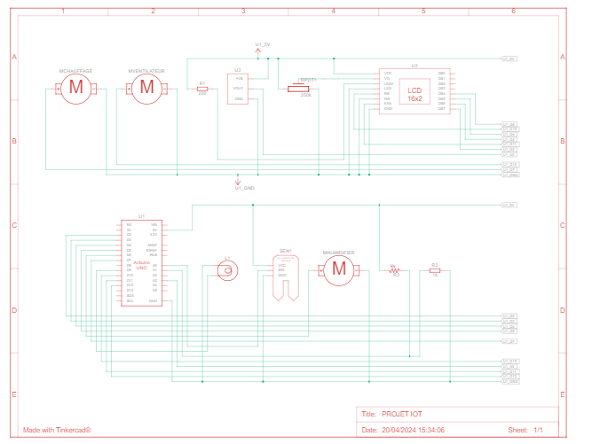

# Real-time Surveillance of Environmental Conditions in Greenhouses through IoT

## Project Objective
The aim of the project is to create an intelligent cultivation environment through IoT, enabling precise monitoring and optimal resource management for sustainable and profitable agriculture. This innovative solution monitors and regulates environmental conditions in greenhouses, thereby improving the sustainability and profitability of crops through reduced water and energy consumption.

## Technology and Components Used
- **Sensors**:
  - **TMP36**: Temperature sensor with a range of -40°C to +125°C.
  - **Photoresistor**: Detects light by changing its electrical resistance.
  - **Soil Moisture Sensor**: Measures the water present in the soil, optimizing irrigation.
- **Actuators**:
  - **Ventilators**: Control air circulation to maintain optimal greenhouse conditions.
  - **Water Pump**: Manages water distribution based on soil moisture sensor readings.
  - **Lamps**: Provide additional light to ensure plants receive the necessary energy for growth.
- **Arduino**:
  - Platform and microcontroller for collecting data from sensors and controlling actuators.
  - **Ethernet Shield**: Enables data transmission to ThingSpeak.
- **Display**:
  - **LCD Screen**: 4-line, 20-character LCD module for local monitoring.
- **Software and Platforms**:
  - **Tinkercad**: Used for designing and simulating the project.
  - **ThingSpeak**: IoT platform for data collection, analysis, and visualization.

## System Architecture
The system uses a set of sensors to gather data on the environmental conditions of the greenhouse. These data are processed by an Arduino equipped with an Ethernet Shield, which then sends the data to ThingSpeak for analysis and visualization. Actuators such as ventilators, water pumps, and lamps are controlled based on sensor data to maintain optimal growing conditions. An LCD screen displays real-time measurements for direct monitoring in the greenhouse.

## Repository Contents
- `Project/`: Folder containing all the design files and code for the system.
- `README.md`: This overview file.

## Results and Impact
This project has demonstrated the capability of IoT technologies to enhance resource management in greenhouses, contributing to more sustainable agricultural practices. Implementing this system can help farmers reduce their resource consumption and maximize the health and productivity of plants.

## Useful Links
- [Presentation Link]([URL-of-presentation](https://www.canva.com/design/DAFdAFdGacA/jEksoIzz_u9FNGC1c7Tm1w/edit?utm_content=DAFdAFdGacA&utm_campaign=designshare&utm_medium=link2&utm_source=sharebutton))

## Notice
Experiments were conducted under real conditions, reinforcing the relevance and applicability of the obtained results. This document summarizes the project and shares valuable insights for stakeholders in the agricultural sector interested in IoT technologies.

